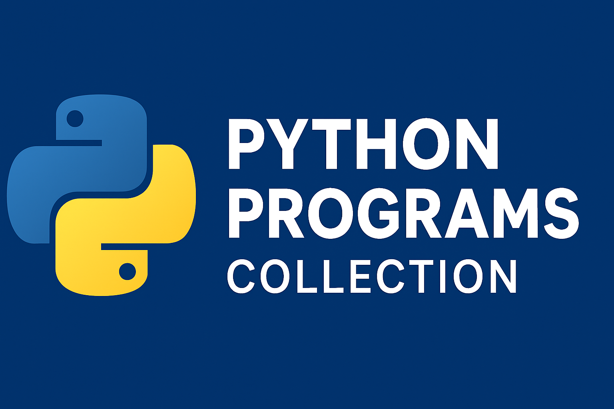

# Python Programs Collection

Welcome to my **Python Programs** repository!  
This is a growing collection of Python scripts, exercises, and mini-projects — from basic syntax and core concepts to problem-solving challenges and automation scripts.  
Whether you’re just starting with Python or revisiting concepts, this repo is designed to help.

---




## What’s Inside?

- **Basics**  
  Simple programs to understand Python syntax, variables, operators, loops, and conditionals.

- **Functions & OOP**  
  Functions, classes, inheritance, polymorphism, and real-world examples.

- **Data Structures & Algorithms (DSA)**  
  Lists, tuples, sets, dictionaries, sorting, searching, and common coding challenges.

- **Automation & Fun Scripts**  
  Small utilities, puzzles, and mini-projects for practice and experimentation.

---

## Why This Repository?

- **Learning Resource** – Great for beginners and intermediate learners to practice Python.  
- **Reference Code** – Quick examples for common patterns and tasks.  
- **Interview Prep** – Covers coding problems that are often asked in technical rounds.

---

## How to Use

1. Clone the repo:
    ```bash
   git clone https://github.com/<your-username>/<your-python-repo>.git

2. Open any .py file in your favorite editor (VS Code, PyCharm, etc.).
3. Run the program:
python filename.py

## Contributions
Contributions are welcome!
If you’d like to add new programs, improve code, or fix bugs:
- Fork the repository
- Create a new branch
- Commit your changes
- Open a pull request
Let’s make this a go-to Python learning resource together! 

## Show Some Love
If this repo helped you, please star ⭐ it on GitHub your support motivates me to keep adding more content!

## Author
Garima Sethi
Email: garimasethi0022@gmail.com

LinkedIn: https://www.linkedin.com/in/garima-sethi-4b7275280/
Let's connect! 
   ```bash
   git clone https://github.com/<your-username>/<your-python-repo>.git
